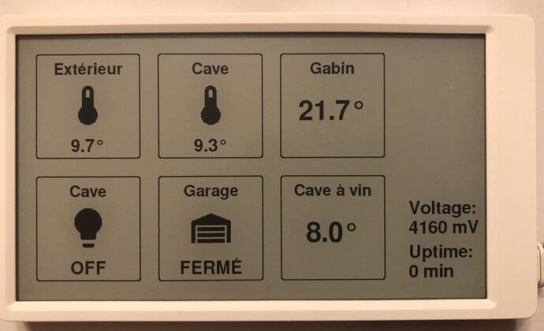

# m5Panel for OpenHAB

## Introduction

This is a preliminary release of using a [m5paper](https://m5stack.com/products/m5paper-esp32-development-kit-960x540-4-7-eink-display-235-ppi) as an automation panel for OpenHAB.

I want it to be as simple as possible : it queries OpenHAB items through REST API, so much of the configuration will be on the OpenHAB side. I don't want "yet another interface to configure with its cryptic syntax".
  
Actually, it just displays the 6 specified OpenHAB item's Label and Status. 
While the is no power optimizations, it can already run several hours on battery.

It has been tested with OpenHAB 2.5 and 3.0

## How to
 - Clone and open in PlatformIO
 - Copy defs-sample.h to defs.h
 - Edit defs.h and customize:
    - Wifi settings
    - Openhab host and port
    - Sitemap to use (default: m5paper)
 - Upload filesystem image (from PlatformIO menu)
 - Compile and upload to m5paper
 - Monitor through serial port

Then, a sitemap containing the items to be displayed must be created.
Here is a sample sitemap :

    sitemap m5panel label="m5panel" {
    	Default item=HueSensor1Temperature      label="Outside[%.1f°]" 
    	Default item=SondeTH4_Temperature 	label="Cellar[%.1f]"
    	Default item=AqaraTemp02Temperature     label="Bedroom[%.1f]" icon=""
    	Default item=SonoffRelay2Power          label="Cellar" icon="light"
    	Default item=gd_currstate               label="Garage[%s]" icon=""
    }

Sitemap rules :
- Use sitemap label formatting
- Label is used as the button title
- The state is extracted from the label value enclosed in [brackets]
- Dynamic icons (light, switch, ...) are based on this state
- If no icon is specified (icon=""), the item state will be displayed in the center of the button
- Else, it will be displayed at the bottom, in a smaller font, under the icon location
- 6 items max are supported for now
- Don't use other sitemap features (frames, ...)

If you're in trouble :
- Check serial log
- Display your sitemap at http://<OPENHAB_HOST>:<OPENHAB_PORT>/basicui/app?sitemap=<OPENHAB_SITEMAP>
- Check you can reach REST API at http://<OPENHAB_HOST>:<OPENHAB_PORT>/rest/sitemaps/<OPENHAB_SITEMAP>

## Known issues
 - First displays are slow (due to font caching)
 - No touch screen support

## Todo
- [X] Nice font and correct encoding
- [X] Dynamic updates
- [X] Basic icon set
- [ ] Touch screen support for commands (switchs, ...)
- [ ] WifiManager for Wifi and items setup
- [ ] Support https connection to OpenHAB
- [ ] Provide binary releases
- [ ] Advanced widgets (gauge, weather, ...)
- [ ] Multi-page navigation
- [ ] Advanced configuration method (for widgets, fonts ...)
